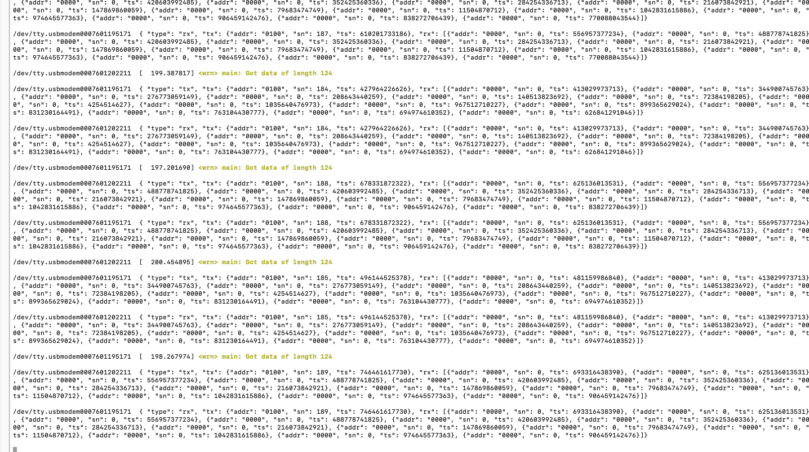

# ALADIN: All-to-all Linear Antenna Delay Inference on Ultra-Wideband Devices

This project contains the PoC for ALADIN: All-to-all Linear Antenna Delay Inference on Ultra-Wideband Devices. It is currently under revision and clean-up.


## Setup
Setup Zephyr and West as usual. As the Decawave Driver does not allow precise timings, we added some overrides which need to be manually applied (see override directory). As an alternative, you can checkout the related [Zephyr feature branch](https://github.com/prathje/zephyr/tree/feature/dwm_1001_ranging_api).
Tested based on commit 6d56b829423056819c4baaafd6c66957752e22f8, while commit eeb4434d2eb5f2c978c59a439688c1f3f46e8bf8 has been reverted due to scheduling exceptions (already included in the overrides).

## Build

Build the project for the Decawave DWM1001 module:

```bash
west build -b decawave_dwm1001_dev --pristine auto
```

You can then flash the boards one by one:
```bash
west flash
```

## Build With Docker

You can also use the included Dockerfile / docker compose file configuration to build (warning this might take a bit of time):

```commandline
docker compose up -d --build

docker compose exec -it build /bin/bash
cp -Rf /app/override/* /zephyr/zephyr/
west build -b decawave_dwm1001_dev --pristine auto
```


To run and deploy on Lille:
```commandline
scp ./build/zephyr/zephyr.elf USER@lille.iot-lab.info:~ && ssh USER@lille.iot-lab.info 'iotlab-experiment submit -d 5 -l lille,dwm1001,1-14,zephyr.elf'
```


In the container you can also easily install script dependencies as follows:
```commandline
pip3 install numpy pandas matplotlib
```
## Scripts

### Serial Monitor

Use the monitor Python script to display JSON outputs of also multiple devices.
```
pip3 install pyserial
python3 monitor.py </dev/tty.dev1> </dev/tty.dev2>
```

The result should look something like this:



